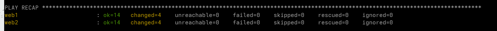
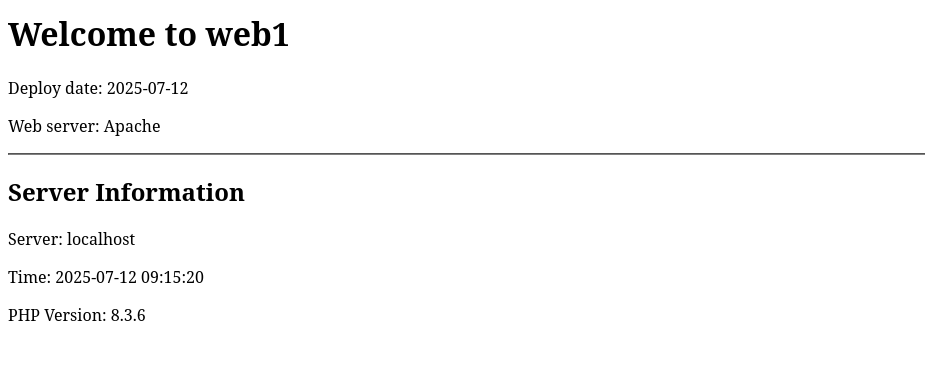

# Ansible lab

## Scenario
My company needs to deploy a simple web application accross multiple servers.

## Lab setup
### Docker containers
Before launching Dockers under, add your root password in the Dockerfile at line 9 **"root:<your_password>"**.

In a CLI launch those commands to setup the lab:

```
# Make sure that you are in the lab folder
pwd

# Create the image based on the Dockerfile
docker build --tag ansible-lab:latest -f Dockerfile .

# Create the two containers
docker run -d --name web1 -p 8081:80 -p 2221:22 ansible-lab:latest
docker run -d --name web2 -p 8082:80 -p 2222:22 ansible-lab:latest

# Insure that our two containers are created
docker ps
```

## Task setup

### Task 1:  create folders architecture
```
ansible-lab/
├── inventory.ini
├── ansible.cfg
├── playbooks/
│   ├── site.yml
│   └── webserver.yml
├── group_vars/
│   └── all.yml
├── host_vars/
├── files/
└── templates/
```

When ansible.cfg and inventory.ini are created. Test it via this command:
```
ansible all -m ping
```
The result:
```
[WARNING]: Platform linux on host web2 is using the discovered Python interpreter at /usr/bin/python3.12, but future installation of another Python interpreter could change the meaning of that path. See https://docs.ansible.com/ansible-
core/2.18/reference_appendices/interpreter_discovery.html for more information.
web2 | SUCCESS => {
    "ansible_facts": {
        "discovered_interpreter_python": "/usr/bin/python3.12"
    },
    "changed": false,
    "ping": "pong"
}
[WARNING]: Platform linux on host web1 is using the discovered Python interpreter at /usr/bin/python3.12, but future installation of another Python interpreter could change the meaning of that path. See https://docs.ansible.com/ansible-
core/2.18/reference_appendices/interpreter_discovery.html for more information.
web1 | SUCCESS => {
    "ansible_facts": {
        "discovered_interpreter_python": "/usr/bin/python3.12"
    },
    "changed": false,
    "ping": "pong"
}
```

### Task 2: Deployment
Now that everything is set up and tested, we can deploy our environments by runnning the following command:

```
ansible-playbook playbooks/site.yml 
```
*<ins>NB.</ins>: use the --check option to lauch a Dry Run of the playbook*

If everything is correctly you should see no failures in the play recap:



Next, navigate to the following URLs:
```
http://localhost:8081/
http://localhost:8082/
```

Here are the screens of you deployed websites:
<div style="display: flex; gap: 10px;">
  
  
</div>

### Memento

Roles are a way to organize and package related tasks, variables, files, templates and handlers into a reusable structured format. Roles promote code reusability and make playbooks cleaner by grouping related automation logic together.

To create a role:

```
ansible-galaxy init <name>
```

OR

```
```